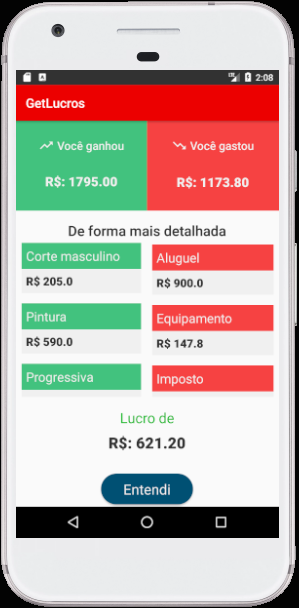
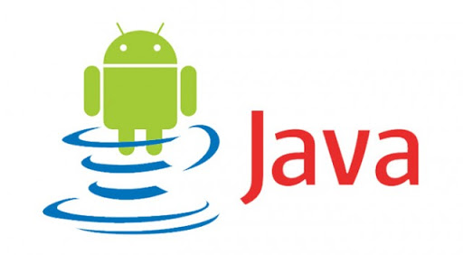

# Get Lucros
## Introdução
O Get Lucros é um aplicativo que visa facilitar auxiliar o pequeno e microempreendedor na gestão financeira de suas empresas.

E para isso o aplicativo trás consigo um design minimalista a fim de descomplicar o processo de lançamento e controle de receitas se tornando amigável a pessoas que não tem muito contato com tecnologia.

Outro ponto importante para o Get Lucros é busca de uma linguagem simples e objetiva para incentivar e facilitar a vida de empreendedores que tem pouca ou nenhuma experência com gestão financeira. 

## Funcionalidades
### Lançamento de receitas:
A interface de lançamento é simples e intuitiva possuindo apenas um campo para adicionar valor e uma categoria, que pode ser criada pelo usuário.

### Relatório do mês:
Um relatório mais detalhado mostrando onde estão concentrado as principais despesas e receitas.

## Tecnologias utilizadas
<a href="https://firebase.google.com/">  <a href="https://developer.android.com/">  <a href="https://www.java.com/pt-BR/">

## Integrantes do Time:
### Alex Junior
[Linkedin](https://www.linkedin.com/in/alex-sandro-momi-junior-382bb8157/)

[Github](https://github.com/AlexJunior01)

### Gustavo Barbosa
[Linkedin](https://www.linkedin.com/in/gustavo-barbosa-b8157916b/)

[Github](https://github.com/gugabs)

### Isabella Barbosa
[Linkedin](https://www.linkedin.com/in/isabella-barbosa-98908b1ab/)

[Github](https://github.com/bellargb)

### João Victor Elias
[Linkedin](https://www.linkedin.com/in/jvictore)

[Github](https://github.com/jvictore)

### Vitor Pacheco
[Linkedin](https://www.linkedin.com/in/vitor-pacheco-de-carvalho-a3292b1a5/)

[Github](https://github.com/vittoi)